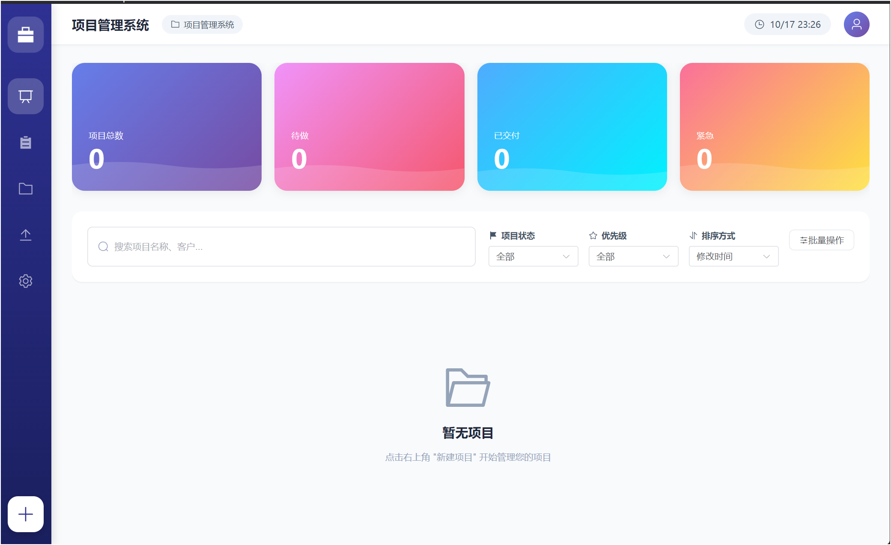
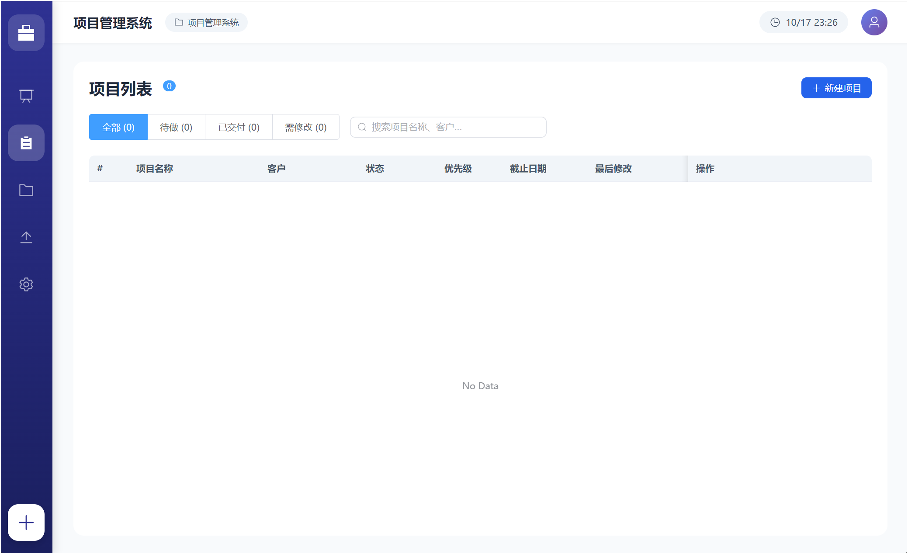
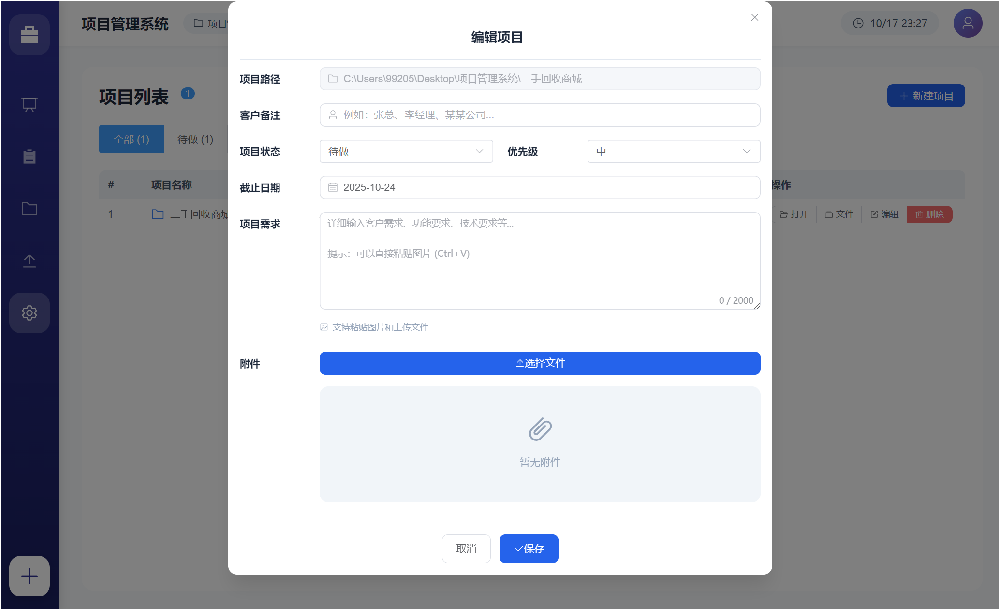

# Project Management System

A modern desktop application for managing web development projects, built with Electron and Vue 3.

English | [简体中文](./README_CN.md)

## Screenshots

### Dashboard


### Project List


### Edit Project


## Features

- **Project Organization**: Manage multiple projects in a centralized workspace
- **Project Lifecycle**: Track project phases (To-Do, Delivered, Needs Modification)
- **Rich Project Details**: Store client information, deadlines, priorities, and requirements
- **File Attachments**: Attach documents, images, and files to projects
- **Batch Operations**: Import existing project folders and batch update project statuses
- **Persistent Storage**: Automatic data persistence with configurable storage location
- **Modern UI**: Clean, professional interface with responsive design

## Tech Stack

- **Frontend**: Vue 3 + TypeScript + Vite
- **Desktop Framework**: Electron
- **UI Library**: Element Plus
- **State Management**: Pinia
- **Data Storage**: JSON file-based with electron-store

## Prerequisites

- Node.js >= 16.0.0
- npm >= 8.0.0

## Installation

1. Clone the repository
```bash
git clone https://github.com/yourusername/project-management-system.git
cd project-management-system
```

2. Install dependencies
```bash
npm install
```

## Development

Start the development server:

```bash
npm run electron:dev
```

This will:
- Start the Vite development server on `http://localhost:5173`
- Launch the Electron application
- Enable hot module replacement for Vue components

## Building

Build the application for production:

```bash
npm run electron:build
```

The built application will be available in the `dist` directory.

## Project Structure

```
project-management-system/
├── electron/              # Electron main and preload scripts
│   ├── main.ts           # Main process
│   └── preload.ts        # Preload script for IPC
├── src/                  # Vue application source
│   ├── components/       # Reusable Vue components
│   ├── views/           # Page-level components
│   ├── stores/          # Pinia state stores
│   ├── types/           # TypeScript type definitions
│   ├── App.vue          # Root component
│   ├── main.ts          # Application entry point
│   └── style.css        # Global styles
├── public/              # Static assets
├── electron-builder.json # Electron builder configuration
├── package.json         # Project dependencies and scripts
├── tsconfig.json        # TypeScript configuration
└── vite.config.ts       # Vite configuration
```

## Configuration

### Data Storage

On first launch, the application will prompt you to select a data storage directory. This directory will contain:
- `projects.json`: Project data
- `attachments/`: Project attachments

You can change the storage location in Settings.

### Workspace

Select a workspace folder where your project folders are located. The application will help you organize and manage folders within this workspace.

## Usage

### Adding Projects

1. Click the "+" button in the sidebar
2. Create a new project folder or select an existing one
3. Fill in project details (client, phase, deadline, etc.)
4. Add requirements and attachments as needed

### Batch Import

Import multiple existing project folders:
1. Click "Batch Import" in the sidebar
2. Select multiple project folders
3. The folders will be moved to your workspace and marked as historical projects

### Project Management

- **View**: Dashboard shows project statistics and quick filters
- **Search**: Filter projects by name, client, or description
- **Sort**: Sort by creation time, modification time, or deadline
- **Update**: Edit project details or batch update project phases
- **Delete**: Remove projects from the system

## Scripts

- `npm run dev`: Start Vite development server
- `npm run build`: Build Vue application for production
- `npm run electron:dev`: Start Electron application in development mode
- `npm run electron:build`: Build and package Electron application

## License

MIT

## Contributing

Contributions are welcome! Please feel free to submit a Pull Request.

For more details, see [CONTRIBUTING.md](./CONTRIBUTING.md) | [贡献指南](./CONTRIBUTING_CN.md)

## Support

If you encounter any issues or have questions, please file an issue on the GitHub repository.

